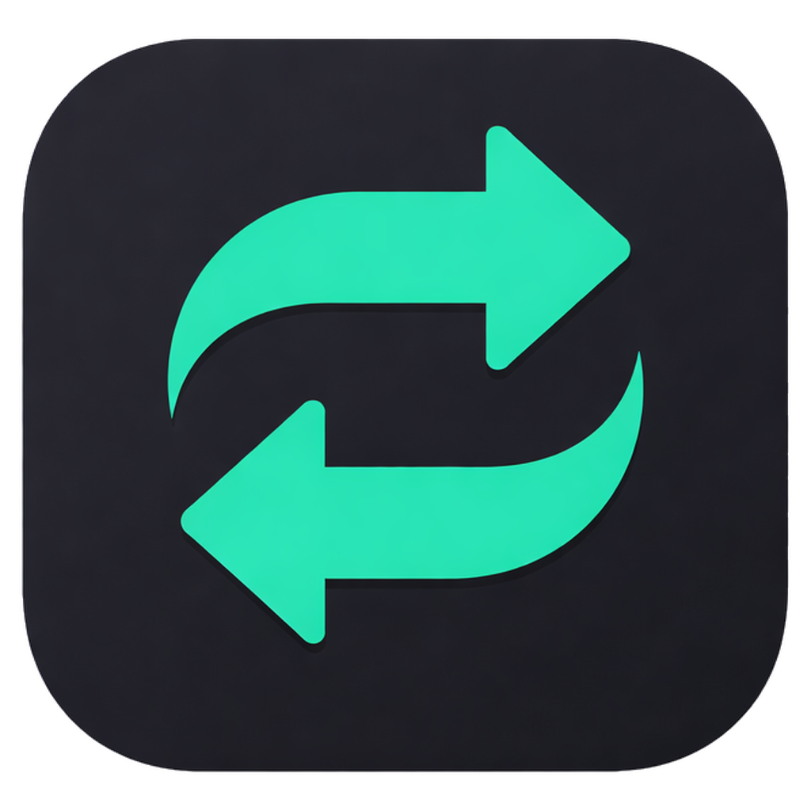
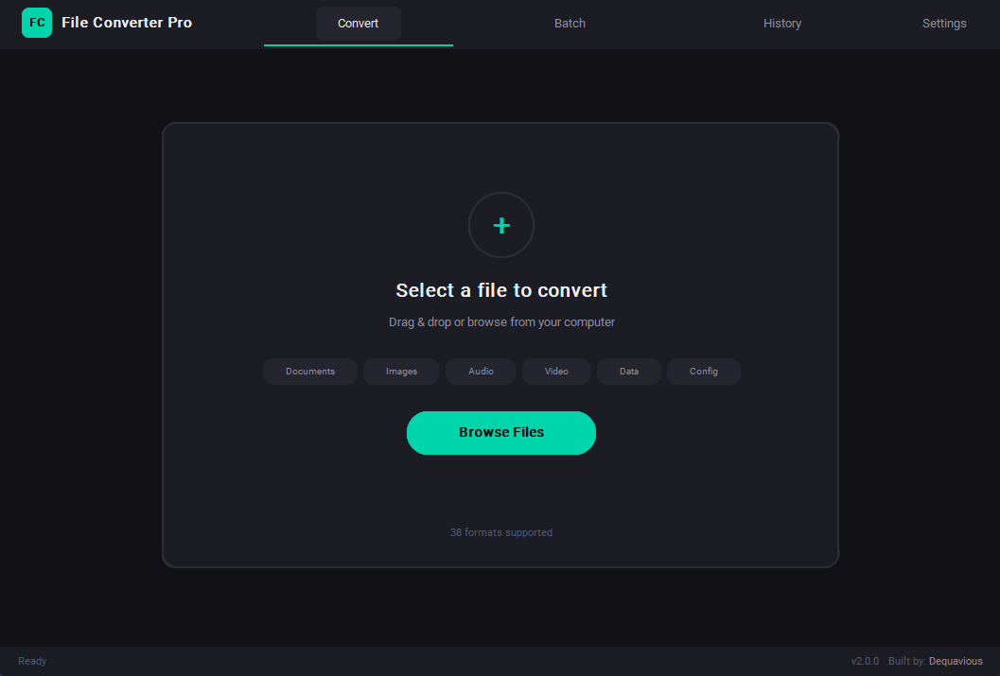
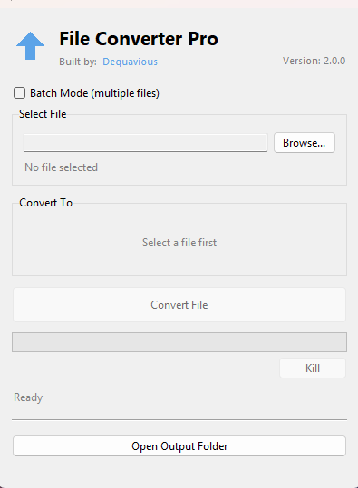

<p align="center">
  
</p>

<h1 align="center">File Converter Pro</h1>

<p align="center">
  <b>Convert anything. Fast. Private. No uploads, no cloud, no limits.</b>
</p>

<p align="center">
  <a href="https://github.com/dequaviousthe7th/File-Converter/releases"></a>
</p>

<p align="center">
  
  
  
  
</p>

<p align="center"><b>Advanced UI</b></p>
<p align="center">
  
</p>

<p align="center"><b>Simple UI</b></p>
<p align="center">
  
</p>

---

## Installation

### Download (Recommended)

> **No coding or technical knowledge required.**

1. Go to the **[Releases](https://github.com/dequaviousthe7th/File-Converter/releases)** page
2. Download **`FCP-Setup.exe`**
3. Run the installer and follow the setup wizard
4. Launch the app from your desktop or Start Menu

That's it. The installer handles everything:

- Installs the full application as a standalone program
- Lets you choose between **Advanced UI** or **Simple UI** as your default
- Optionally installs **ffmpeg** (audio/video) and **Pandoc** (documents) for you
- Creates desktop and Start Menu shortcuts
- Registers in Add/Remove Programs for easy uninstallation
- Both UIs are always installed — switch between them anytime with the built-in switch button

### Manual Installation (Developers)

<details>
<summary>Click to expand</summary>

If you prefer to run from source:

1. Clone the repository
2. Make sure Python 3.8+ is installed
3. Create a virtual environment and install dependencies:
   ```bash
   python -m venv venv
   venv\Scripts\activate        # Windows
   pip install -r requirements.txt
   ```
4. Run your preferred UI:
   ```bash
   python app.py               # Advanced UI
   python app_simple.py        # Simple UI
   ```

Or on Windows, double-click `START.bat` (Advanced) or `START_SIMPLE.bat` (Simple).

</details>

---

## Overview

**File Converter Pro** is a desktop file conversion tool with **200+ conversion paths** across documents, images, audio, video, spreadsheets, and config files. Everything runs **100% locally** on your machine — no files are uploaded anywhere.

Ships with two UI modes you can switch between at any time:

| | Simple UI | Advanced UI |
|--|-----------|-------------|
| **Style** | Classic, lightweight | Modern dark studio theme |
| **Best For** | Quick single conversions | Power users, batch workflows |
| **Batch Mode** | Checkbox toggle | Dedicated page |
| **History** | — | Full conversion history |
| **Settings** | — | Output folder, quality, bitrate |
| **Drag & Drop** | Yes | Yes |
| **Kill Button** | Yes | Yes |

---

## Supported Formats

### Documents

| From | To |
|------|----|
| PDF | DOCX, TXT, MD, PNG, JPG, HTML |
| DOCX | PDF, TXT, MD, HTML |
| TXT | PDF, DOCX, MD |
| Markdown | PDF, DOCX, TXT, HTML |
| HTML | PDF, DOCX, TXT, MD |
| RTF | PDF, DOCX, TXT |
| EPUB | PDF, TXT |

### Images

| From | To |
|------|----|
| PNG, JPG, JPEG | JPG/PNG, WEBP, BMP, PDF, TIFF, ICO, GIF |
| WEBP, BMP, TIFF | PNG, JPG, WEBP, BMP, PDF, TIFF, GIF |
| GIF | PNG, JPG, WEBP, BMP, PDF |
| ICO | PNG, JPG, BMP |
| SVG | PNG, JPG, WEBP, PDF |
| HEIC/HEIF | PNG, JPG, WEBP, BMP, PDF, TIFF |

### Audio (requires ffmpeg)

| From | To |
|------|----|
| MP3, WAV, FLAC, OGG, AAC, M4A, WMA | MP3, WAV, FLAC, OGG, AAC, M4A, WMA |

### Video (requires ffmpeg)

| From | To |
|------|----|
| MP4, AVI, MKV, MOV, WebM | MP4, AVI, MKV, MOV, WebM, GIF |

### Data / Spreadsheets

| From | To |
|------|----|
| CSV | XLSX, JSON, TSV, HTML |
| XLSX | CSV, JSON, TSV, HTML |
| JSON | CSV, XLSX, YAML, TOML, TSV |
| TSV | CSV, XLSX, JSON |

### Config

| From | To |
|------|----|
| YAML | JSON, TOML |
| TOML | JSON, YAML |

---

## Features

- **200+ Conversion Paths** across 55+ file formats
- **Dual UI Modes** — Switch between classic simple and modern dark theme anytime
- **Batch Conversion** — Convert multiple files in a single queue
- **Drag & Drop** — Drop files directly onto the window
- **Kill Button** — Cancel any conversion instantly
- **Real Progress** — Live progress reporting with status messages
- **Conversion History** — Track all past conversions (Advanced UI)
- **Configurable Settings** — Output folder, image quality, audio bitrate
- **100% Local** — No internet required, no files uploaded anywhere

---

## Contributing

1. Fork the repository
2. Create a feature branch (`git checkout -b feature/new-feature`)
3. Commit your changes (`git commit -m 'Add new feature'`)
4. Push to branch (`git push origin feature/new-feature`)
5. Open a Pull Request

---

## License

MIT License — see [LICENSE](LICENSE) for details.

---

<p align="center">
  <b>Built by <a href="https://github.com/dequaviousthe7th">Dequavious</a></b>
</p>
